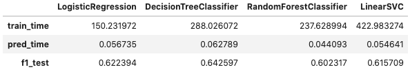

# Data Science Capstone Project - Sparkify

This project contains the files for the implementation of the Data Science Nanodegree Capstone Project with Udacity.

Supporting [Medium Post](https://medium.com/@Tom_Butler/modelling-music-app-churn-2254eb97bdee).

# Table of Contents

1. [Motivation](#1.-Motivation)
2. [Files](#2.-Files)
3. [Tools used](#3.-Tools-Used)
4. [Results summar](#4.-Results-Summary)

## 1. Motivation

Businesses are trending digitally which opens up a stream of data to give insight on how customers are interacting with products or services that browsing in a brick and mortar store never would. A crucial application is studying what behaviours lead to customer churn (e.g., cancelling a subscription, closing an account), a costly event for the business. This is especially relevant to those companies that rely solely on subscriptions for income, like SaaS (Software as a Service) companies - where it is more costly to onboard a new client rather than retain one - or media streaming services (your Spotify's and Netflix's of the world).

In this project we clean and prepare the Sparkfiy dataset of event logs to create a machine learning model that identifies customer churn.

Churn was defined for any customer who confirmed their cancellation or downgraded their account from a premium to a free one.

## 2. Files

The files in the repository are:

- **EDA.ipynb**: the Jupyter notebook used for exploring the small sample of the data.
- **Sample-Model-Build.ipynb**: the Jupyter notebook used for developing the models locally.
- **Sparkify-EMR.ipynb**: the Jupyter notebook used to interact with the EMR cluster. It has a streamlined layout to the notebook developed locally.

## 3. Tools Used

The tools used in this project are as follows:

- **AWS EMR**: Elastic Map-Reduce cluster of 3 m5.xlarge notes to handle the full 12GB dataset.
    - Used `emr-5.29.0` as I ran into connection issues on version 30.
    - Software configuration of `Spark 2.4.5 on Hadoop 2.8.5 YARN and Zeppelin 0.8.2`.
    - Vital to select `Use AWS Glue Data Catalog for table metadata`. 
    - Proceeded without an EC2 key pair.
- **PySpark**: version as per the distribution on the cluster above. On my local machine it was PySpark 3.0.0.
- **Python 3.7.6**: this is the version used locally on my machine in developing the notebooks.

The Python libraries used in this project were:

- pandas
- json
- seaborn
- matplotlib
- datetime
- time

The PySpark libraries used in this project were:

- pyspark.sql
- pyspark.sql.types
- pyspark.sql.functions
- pyspark.ml.feature
- pyspark.ml.classification
- pyspark.ml.evaluation
- pyspark.mllib.evaluation
- pyspark.ml.tuning

## 4. Results Summary

I chose **F1-Score** as the metric we wanted to maximise. This is better to use when there are imbalanced classes - as in this case - such that False Negatives and False Positives are crucial.

The below image displays the results for the initial build of the four models looked at in development. The linear regression and decision tree models were taken forward for tuning and testing on the full dataset based off their cost and performance.

The logistic regression model showed improvement in the local parameter tuning, taking the F1 score from 0.622 to 0.675.

Moving the models to the AWS EMR cluster to train and be evaluated against the full 12GB dataset gave improvements to the baseline models of both, giving:

- Logistic Regression F1 Score: 0.702,
- Decision Tree Model F1 Score: 0.707.

Tuning on the cluster was did not give improvements.

To conclude, the recommended model is the decision tree model with the F1 score of 0.707 on the full data set.
